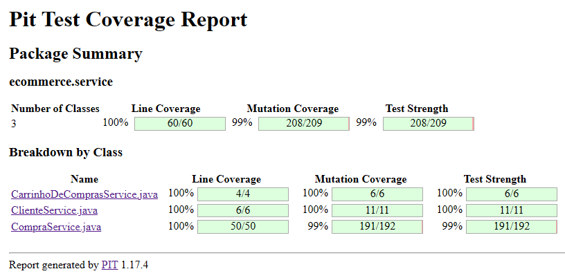

# Projeto E-commerce

Este projeto trata da implementação de testes automatizados para a funcionalidade de finalização de compra em um sistema de e-commerce. O sistema foi estruturado como uma API REST.

## Referência
Para mais detalhes sobre o enunciado do trabalho, consulte o arquivo [Enunciado.md](./Enunciado.md), que fornece o contexto e as especificações completas para a implementação da funcionalidade de finalização de compra e os requisitos dos testes.

## Pré-requisitos

Certifique-se de ter as seguintes ferramentas instaladas:
- **Java JDK** 11 ou superior
- **Maven**
- Um IDE (recomendado: IntelliJ IDEA ou Eclipse)

## Configuração do Projeto

1. Clone o repositório:
   ```bash
   git clone <url-do-repositorio>
   cd <nome-do-repositorio>
   ```

2. Importe o projeto em sua IDE:
    - Abra a IDE e selecione **Import Project**.
    - Escolha o arquivo `pom.xml` para importar como um projeto Maven.

3. Verifique a presença do plugin do PIT Mutation Testing no arquivo pom.xml:
   ```
   <plugin>
    <groupId>org.pitest</groupId>
    <artifactId>pitest-maven</artifactId>
    <version>1.17.4</version>
    <dependencies>
        <dependency>
            <groupId>org.pitest</groupId>
            <artifactId>pitest-junit5-plugin</artifactId>
            <version>1.1.0</version> <!-- Versão do plugin para JUnit 5 -->
        </dependency>
    </dependencies>
    <configuration>
        <targetClasses>
            <param>ecommerce.service.*</param> <!-- Classes do serviço para mutação -->
        </targetClasses>
        <targetTests>
            <param>ecommerce.*Test</param> <!-- Testes que serão executados -->
        </targetTests>
        <outputFormats>
            <param>HTML</param>
        </outputFormats>
        <mutators>
            <mutator>ALL</mutator>
        </mutators>
    </configuration>
   </plugin>
   ```

4. Compile o projeto:
   ```bash
   mvn clean install
   ```

## Executando os Testes

1. Para rodar todos os testes:
   ```bash
   mvn test
   ```
   
2. Certifique que todas as classes de testes foram listadas no diretório:
   ```
   target/test-classes/ecommerce
   ```

## Verificação de Mutação

1. Para executar os testes de mutação utilizando o plugin **PIT Mutation Testing**:
   ```bash
   mvn org.pitest:pitest-maven:mutationCoverage
   ```

2. O relatório será gerado no diretório:
   ```
   target/pit-reports/<data-e-hora>/index.html
   ```

3. Abra o arquivo `index.html` no navegador para visualizar o relatório de mutação.
4. Exemplo de conteúdo do relatório:
   
---

Siga estas etapas para garantir que o projeto esteja funcionando corretamente e que todos os testes estejam cobrindo os cenários esperados.

## Identificação de Autoria

- *Lucas Morais*
- *Jonathan Julio*
